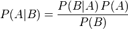

# 文档过滤
## 过滤垃圾信息
* 基于规则的过滤（缺点很明显）
* 从垃圾邮件这个题目开始考虑

## 文档和单词
* 文档对应于文本内容，单词可以看做是文档的特征
* 如何选择特征集是需要根据实际情况来考虑

## 对分类器进行训练
* 类别，是最终的过滤后，某个输入所属的类别
* 特征，针对一个输入，人为地选择一些特质值，作为分类的依据
* fc 统计特征/分类的组合的数量

```
{"python":{"good":6, "bad":0}, "money",{"good":3, "bad", 3}}
// 其中特征python作为key，对应出现的分类{"good":6, "bad":0}作为value，那么
fc = 2;
```

* cc 每个分类中文档的数量

```
{"python":{"good":6, "bad":0}, "money",{"good":3, "bad", 3}}
good类中的文档数量为 6 + 3 = 9，bad类的文档数量为 0 + 3 = 3
```

* getfeatures 获取特征值的函数，返回的是特征值的一个向量


## 计算概率
* 特征在分类中出现的概率（单词属于某个分类的概率）

> 单词python出现在good分类中的概率为 6 / (6 + 3) = 0.6666
> 在给定了分类good的情况下，出现单词python的概率，如果没有给定分类good，那么这种概率就不存在，所以前提条件必须存在才会有意义

## 从一个合理的推测开始
* 如果根据上述的计算概率的公式，如果“money”特征只出现在bad分类中一次，那么相对于good分类来说，money的概率为零。实际的情况是money是个中性词，只是恰好没有出现在good分类中罢了，可能的原因是我们的样本数量的局限。为了解决这个问题，我们需要做一个加权平均。首先假设任何一个特征对应所有的分类来说，都具有一个假设的初始化概率，比如0.5，如果在后面训练的过程中如果没有出现，那么这个特征相对于一个分类的概率只会越来越趋近于零，这个符合了现实，在一般的数据量下，并不会影响结果，同事，做出这种情况下的weight为1，相当于是一个站位，假设了这种情况的存在

## 朴素分类器（Naive Classifier）
* 目前为止，我们只能得到一个单词在在某个分类下的概率，我们的目标是一篇文档在某个分类下的概率，所以需要将这些特征值进行组合，代表一个文档，此时计算出的组合出现的概率就是文档出现的概率
* 朴素分类器的限时是单个特征是独立的，跟其他的特征值不相关，这个是有违现实的

## 整篇文档的概率
* 基于朴素分类器将单个特征值的概率视作独立，可以将整篇文档基于一个分类的概率写成所有的特征值在改分类条件下的概率的乘积。表达的意思就是所有特征值同时被分成某个类的概率，结合具体的场景，就是单词python和money同时存在于good文档中的概率
* 现在我们计算出了文档相对于一种分类的概率，但是我们实际上需要的是对于一篇给定的文档相对于某一个分类的概率
* 对结果的调整，为了让实际上是good类的文档被误分类到bad类中，首先我们得到了一个在所有分类中概率最大的分类，假设为bad类，那么这时候，我们需要对bad类做更加严格的控制，不要这篇文档轻易地进入到这个分类中，设置一个bad分类的阈值3，即是要求现在获取到的最大的概率（bad类时的概率）必须要是次大概率（被选为good类的概率）的3倍以上才可以被选入bad类，否则就会进入到unknown类，这时候会提示用户是否需要过滤

## 贝叶斯定理简介


## 费舍儿方法
* 与朴素贝叶斯过滤器利用特征概率来计算整篇文档的概率不同，费舍尔方法为文档中的每个特征求得了分类的概率，然后将这些概率组合起来

## 针对特征的分类概率
* 一篇文档中出现某个特征时，属于某个分类的可能性
* Pr(category/feature) = (具有指定特征的属于某个分类的文档数) / （具有指定特征的文档总数）
* 有个假设：未来将受到各个文档在各个分类中是相当的

## 将各个概率值组合起来
* 现在我们能够得到一个特征出现时，属于某个分类的概率，假设我们一篇文档中出现hello world 两个特征值， hello在good文档中的概率为0.8， 在bad文档中的概率为0.2， world为0.6 和 0.4 那么针对于该文档而言，出现在good文档中的概率为 0.8 * 0.6 = 0.48， 出现在bad文档中的概率为0.2 * 0.4 = 0.08 通过比较两个的大小，发现这篇文档属于good的文档的概率要大，但是比较大小并不是一种最为合理的选择方式
* 费舍尔的计算过程是将所有的概率相乘，然后取自然对数，最后利用导致对数卡方函数求得概率，其实是取得集合概率中的最大的一个

## 对文档进行分类
* 到目前为止，我们可以知道一篇特定的文档属于某种分类的最大的概率值，循环遍历所有的分类，得到其中最大的一个，这时候理论上可以得出该文档应该被归为哪一类
* 有时候我们为了结合现实生活，并不想出现将一篇原本是好的文档放在bad分类中，那么可以设置一个最小的概率值，在分为bad分类前，之前计算出来的概率值必须超过这个最小的阈值才可以放进bad分类中，这种调整比朴素贝叶斯更加灵活，任何小于最小阈值的文档被归为未知

## 经过训练的分类器持久化
## 过滤博客订阅源
## 对特征检测的改进
## 使用Akismet
## 替代方法